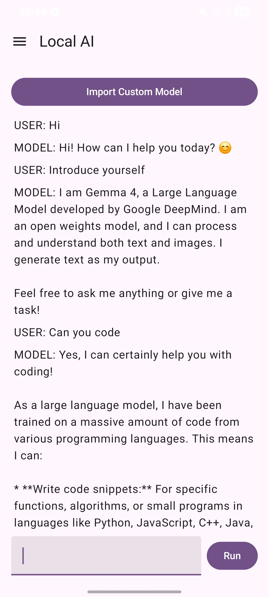
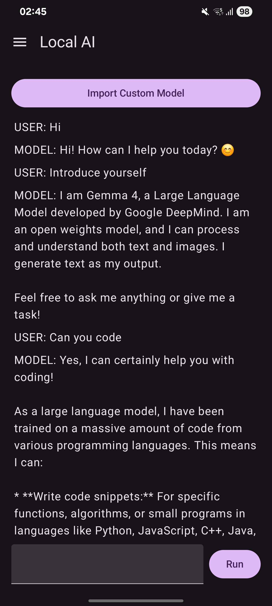

# Local AI Android
Local AI is a privacy-first, on-device artificial intelligence assistant for Android. Built with Jetpack Compose and LiteRT, this application allows users to run local language and vision models directly on their mobile devices, ensuring complete data privacy and offline capability.

  
  &nbsp;&nbsp;&nbsp;&nbsp;
  

# Key Features
* Offline Inference: Run Llama 3.2, Qwen 2.5 Coder, Gemma and Moondream models locally using LiteRT.

* Persistent Storage: Uses Room Database to store chat history, ensuring your conversations are available even after the app is closed.

* Modern UI: Built with Jetpack Compose and supports Material You dynamic color theming.

* Hardware-Aware: Designed to manage the lifecycle of machine learning engines, ensuring memory is handled efficiently within the Android ViewModel scope.

# Getting Started
1. Download the App
You can download the latest production build from Releases Page.

2. Prepare Your Models
To use the AI capabilities, you will need to provide your own LiteRT-compatible (.litertlm) model files.

1.Download your preferred quantized models (e.g., Llama 3.2, Moondream 2, Gemma 4).

2.Use the "Import Model" button within the app to load the .litertlm files from your device storage.

Architecture
This project is built using a clean, layered architecture:

* UI Layer: Jetpack Compose with StateFlow for reactive, real-time UI updates.

* Domain Layer: MemoryManager and LiteRTRepository handle the business logic of inference and model lifecycle management.

* Data Layer: Room handles persistent storage for chat sessions and metadata.

Built With
* Language: Kotlin

* Framework: Jetpack Compose

* AI Engine: LiteRT (TensorFlow Lite)

* Database: Room

* Concurrency: Kotlin Coroutines & Flow
